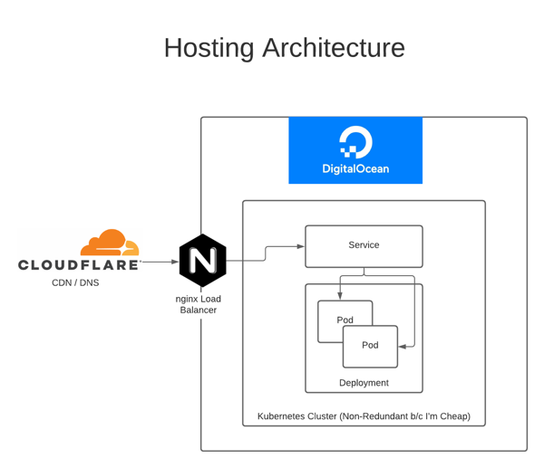

# Roman Numeral Generator

This application takes a number and outputs the corresponding roman numeral.

This implementation is based on the Standard Form as [documented by Wikipedia](https://en.wikipedia.org/wiki/Roman_numerals#Standard_form).

## Engineering

The implementation of the actual conversion is based on readability and simplicity over Lines of Code. Looking at the table on Wikipedia, I mentally visualized a Roman Numeral as being a two dimensional array of digits and characters.

Each number could be then resolved by first splitting the number into it's consitutent digits and then looking up the matching value in the table. For example would be a combination of the characters found at:

    1258 -> [0][1], [1][2] , [2][5], [3][8]]
    -> M CC L VIII
    -> MCCLVIII
    
For simplicty's sake in supporting unknown size numbers, the implementation reverses the order of the digits, having ones take the 0'th index and thousands take the third. My preference was to validate parameters to ensure they were valid versus handling with exceptions. Only whole, base10 numbers between 1-3999 are allowed to be provided.

### Limitations

The implementation only supports positive whole numbers in decimal format between 1-3999. Theoretically larger numbers could be supported by updating the [./src/numerals.json](./src/numerals.json) and [./src/romannumeral.js](./src/romannumeral.js) to map larger values, but this was not in the scope of requirements for this project.

### Project Structure

There are multiple components which make up this project including:

 - ./package*.json, src/ and test/ - NodeJS service using ExpressJS
 - Dockerfile - Docker container definition for running the NodeJS service
 - helm - Helm chart for provisioning a Kubernetes deployment to run the container(s)
 - .github/workflows - Github Action YAML configurations

### Prerequisites

Running this project requires the following dependencies to be pre-installed:

 - NodeJS 14+
 - NPM 6+

Optional, for local Docker / Kubernetes testing:

 - Docker 20+
 - Kubernetes 1.19+
 - Helm 3
 - Minikube 1.15+

## Build and Run
 
### Local Build / Run

To build and run the NodeJS base of the project run the following commands from the project directory:

 1. `npm install`
 2. `node .`

This will start a server on the port 8080 which will respond to requests in the following format: http://localhost:8080/romannumeral?query=3

### Docker Local Build / Run

In addition to running the NodeJS app you can run via a Docker container:

 - Ensure port 8080 is unassigned
 - Run: `npm run init:env`
 - Run: `npm run build:docker`
 - Run: `npm run run:docker`

Which can be accessed at:
http://localhost:8080/romannumeral?query=23

### Helm / Kubernetes Local Build and Run

First, you'll need to setup a local K8s cluster with minikube. To configure Minikube as needed run the following commands:

    minikube start --vm=true
    minikube addons enable ingress
    minikube addons enable metrics-server
    minikube ip

Once this is complete, you can install the helm chart:

    export HELM_NAME=local
    export VERSION=1.0.2
    export HELM_ACTION=install
    npm run init:env
    npm run deploy:helm

Finally, create an /etc/map entry:

`[minikube ip]   roman-numeral.local`

Updates to the chart / app can be deployed with:

    export HELM_NAME=local
    export VERSION=[new-version]
    export HELM_ACTION=upgrade
    npm run init:env
    npm run deploy:helm

Once all the steps are complete, the service can be accessed at:
http://roman-numeral.local/romannumeral?query=12

## Testing

### Testing NodeJS

Tests are executed using MochaJS, to run tests, build the project and run:

`npm run test`

### Testing Helm

To validate the Helm chart, run:

`npm run test:helm`

## Continuous Integration

Github Actions are used to build, release and deploy code to the environments. There are three actions:

 - [.github/workflows/ci.yml](.github/workflows/ci.yml) - Automatically build and test the code on pull request or commit to `main`
 - [.github/workflows/release.yml](.github/workflows/release.yml) - Release the docker image to Github Container Registry
 - [.github/workflows/deploy.yml](.github/workflows/deploy.yml) - Deploy the helm chart to the selected environment
 

## Production Deployment

The application is running at https://roman-numeral.danklco.com/romannumeral?query=23 inside a DigitalOcean Kubernetes cluster with the following architecture:

The application is fronted by CloudFlare providing a CDN / DNS and then a nginx-based LoadBalancer required by DigitalOcean to open their Kubernetes clusters to the internet.

## Metrics

Metrics are tracked via [Airbrake](https://airbrake.io/) for consistent monitoring of application logs and performance.

To configure Airbrake monitoring specify the following environment variables:

- AIRBRAKE_PROJECT_ID
- AIRBRAKE_PROJECT_KEY
- AIRBRAKE_ENVIRONMENT

These are provided in GitHub Actions build time via Secrets. The server will load these values automatically from a .env file, in addition to expose those variables at build time (for the Docker container) run: `npm run init:env`

## Dependencies

In addition to the prerequisite software, the following dependencies are used by this project:

### Runtime Dependencies

- @airbrake/node - instrumentation and metrics client
- dotenv - load environment properties from .env to ease running locally
- express - httpd server for NodeJS
- helmet - hardening for express services,
- winston - logging framework for NodeJS

### Testing Dependencies

- chai - enhanced assertions library
- chai-http - http client for testing, used for integration testing the NodeJS server
- get-port - finds an open port to run the test server on
- mocha - unit testing framework
- nyc - code coverage framework

### Build Dependencies

 - actions/checkout@v2 - checkout Git code
 - mtchavez/airbrake-deploy@v1 - report a deployment to airbrake
 - matootie/dokube@v1.3.4 - authenticate with Digital Ocean Kubernetes
 - SonarCloud - code quality / static code analysis
